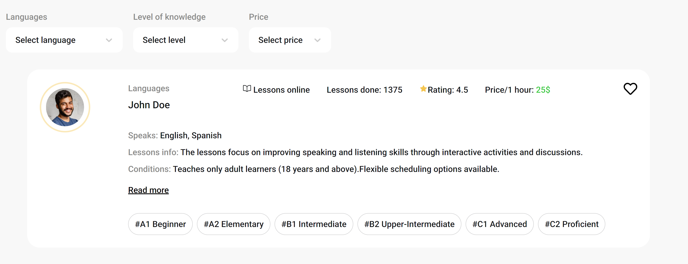

# Learn Lingo

A simple React-based application created for offering online language learning services. It includes features such as teacher list filtering, adding teachers to favorites and booking a trial session.

[Demo](https://learnlingo-ivory.vercel.app/)

---

# Clone repo

git clone https://github.com/sonjagnt/learnlingo

# Install dependencies

npm install

# Run developer mode

npm run dev

# Usage

- Click 'Get started' or use header navigation to see available teachers.
- Filter the list to match your preferences.
- Click 'Read More' to get detailed information about chosen teacher.
- Book a trial session using the booking form.
- Create an account and log in to use favorites feature. You can do it by using header navigation.
- Optional: add teachers to favorites by clicking the heart icon in the list.

# Technologies

- React
- Redux Toolkit
- Vite
- CSS Modules
- Firebase Realtime Database

# Future plans:

- Add "reset filters" button
- Migrate all logic to FireStore
- Implement sending an email verification to the users who has booked a trial session
- Implement creating an account using email and phone number from booking form, if user hasn't created an account yet

Creator:
[@sonjagnt](https://github.com/sonjagnt)
